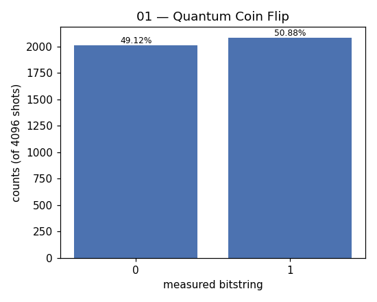

# 01 — Quantum Coin Flip (superposition)

**Difficulty:** ⭐ (start here)
**Concept:** superposition, the Hadamard gate, measurement collapse

## What is it for?
The single most basic quantum program. It shows the one thing that makes a
qubit different from a classical bit: a qubit can be in a **superposition** of
0 *and* 1 at the same time. Measuring it forces a random choice. This is a
genuinely random coin — the randomness comes from physics, not from a formula.

## Classical vs quantum
- A classical bit is always either 0 or 1.
- A qubit after a Hadamard gate is `(|0> + |1>)/√2` — equal parts of both.
- Measuring collapses it to 0 or 1, each with probability 50%.

## The gate
The **Hadamard gate `H`** is the "make superposition" gate:
```
H|0> = (|0> + |1>)/√2
```

## Circuit
```
q: |0> ──[H]──[measure]
```

## Code
[`code/01_coin_flip.py`](../code/01_coin_flip.py)

## Run it
```bash
cd code && python3 01_coin_flip.py
```
Runs on the local ideal simulator (`StatevectorSampler`) — no hardware, no cost.

## Result
Raw numbers: [`result/01_coin_flip.json`](../result/01_coin_flip.json)



| measured bit | count | probability |
|---|---|---|
| `0` | 2012 | 49.12% |
| `1` | 2084 | 50.88% |

**Reading it:** ~50/50, as expected for a fair coin. The tiny gap from exactly
50% is ordinary sampling noise over 4096 shots, not bias.

## Takeaway
One gate turns a definite bit into a fair random bit. Superposition +
measurement = quantum randomness.
