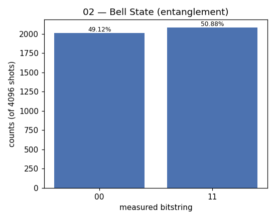

# 02 — Bell State (entanglement)

**Difficulty:** ⭐
**Concept:** entanglement, the CNOT gate, correlated measurement

## What is it for?
Shows **entanglement** — the second core quantum idea after superposition. Two
qubits become linked so that measuring one instantly tells you the other, even
if they are far apart. Einstein called it "spooky action at a distance." Bell
pairs are the fuel for teleportation, superdense coding, and quantum key
distribution.

## The state
The Bell state `|Φ+>`:
```
|Φ+> = (|00> + |11>)/√2
```
You get either 00 or 11 — never 01 or 10. The two qubits **always agree**, but
which value is random until measured.

## How to build it
1. `H` on qubit 0 → superposition on q0.
2. `CNOT(0→1)` → flips q1 only when q0 is 1, tying them together.

## Circuit
```
q0: |0> ──[H]──■──[measure]
               │
q1: |0> ───────X──[measure]
```

## Code
[`code/02_bell_state.py`](../code/02_bell_state.py)

## Run it
```bash
cd code && python3 02_bell_state.py
```

## Result
Raw numbers: [`result/02_bell_state.json`](../result/02_bell_state.json)



| measured | count | probability |
|---|---|---|
| `00` | 2012 | 49.12% |
| `11` | 2084 | 50.88% |

**Reading it:** only `00` and `11` appear. The forbidden `01`/`10` are absent —
that absence *is* the entanglement.

## Takeaway
`H` then `CNOT` is the standard recipe for a Bell pair. Correlation without a
pre-agreed value is impossible classically.
