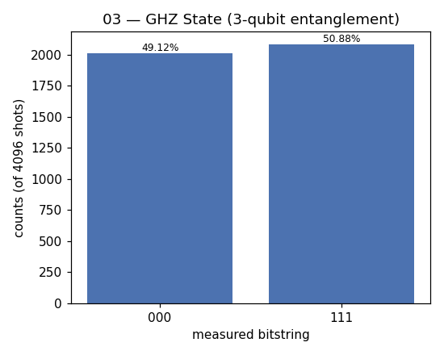

# 03 — GHZ State (multi-qubit entanglement)

**Difficulty:** ⭐⭐
**Concept:** scaling entanglement to 3+ qubits

## What is it for?
Extends the Bell pair to three (or more) qubits all locked together:
```
|GHZ> = (|000> + |111>)/√2
```
Measure any one qubit and you instantly know the other two. GHZ states are used
in quantum **error correction**, high-precision **metrology**, and famous tests
that rule out "local hidden variable" explanations of quantum mechanics.

## How to build it
`H` on the first qubit, then a fan of CNOTs spreading its "flip" to all others.

## Circuit
```
q0: |0> ──[H]──■──■──[measure]
               │  │
q1: |0> ───────X──│──[measure]
                  │
q2: |0> ──────────X──[measure]
```

## Code
[`code/03_ghz_state.py`](../code/03_ghz_state.py)

## Run it
```bash
cd code && python3 03_ghz_state.py
```

## Result
Raw numbers: [`result/03_ghz_state.json`](../result/03_ghz_state.json)



| measured | count | probability |
|---|---|---|
| `000` | 2012 | 49.12% |
| `111` | 2084 | 50.88% |

**Reading it:** all three qubits agree every time — only `000` and `111`. No
in-between states.

## Takeaway
Entanglement scales: one `H` plus a chain of CNOTs entangles as many qubits as
you like. The bigger the GHZ state, the more "fragile" and interesting it is.
