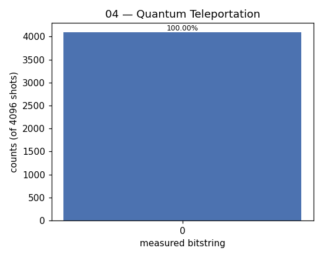

# 04 — Quantum Teleportation

**Difficulty:** ⭐⭐
**Concept:** using entanglement + classical bits to move a quantum state

## What is it for?
Moves the **state** of one qubit onto another qubit without physically sending
the qubit through space. It needs a shared Bell pair plus two classical bits.
Crucially it does **not** copy — the no-cloning theorem forbids copying an
unknown quantum state — the original is destroyed. Teleportation is the routing
primitive of quantum networks and the quantum internet.

## The players
- `q0` — Alice's secret "message" qubit (here `Ry(θ)|0>`, a nontrivial state).
- `q1`, `q2` — a Bell pair; Alice holds `q1`, Bob holds `q2`.

## Steps
1. Prepare the secret state on `q0`.
2. Build the Bell pair on `q1`,`q2`.
3. Alice does a Bell-basis measurement on `q0`,`q1` (`CNOT` then `H`).
4. Bob applies an `X` and/or `Z` correction based on Alice's 2 classical bits.

In the code the corrections use the **deferred-measurement** trick (they are
written as quantum-controlled `CX`/`CZ`) so the whole thing is one clean circuit
the simulator runs in one go.

## How we verify it worked
If Bob's `q2` truly became the secret state, then undoing the preparation
(`Ry(-θ)`) on `q2` must return it to `|0>`. So a correct teleport gives
`q2 = 0` essentially 100% of the time.

## Circuit (sketch)
```
q0(msg): [Ry θ]──────■──[H]───────■─── (Alice measures)
q1(bell):    [H]──■──X────────■────│───
q2(bell):─────────X───────────X────Z──[Ry -θ]──[measure]
```

## Code
[`code/04_teleportation.py`](../code/04_teleportation.py)

## Run it
```bash
cd code && python3 04_teleportation.py
```

## Result
Raw numbers: [`result/04_teleportation.json`](../result/04_teleportation.json)



| measured (q2) | count | probability |
|---|---|---|
| `0` | 4096 | 100.00% |

**Reading it:** `q2` returns to `0` every single time — proof the secret state
arrived at Bob intact.

## Takeaway
Entanglement + 2 classical bits = transport an unknown quantum state. No
faster-than-light communication (you still need to send the classical bits),
and no cloning (the source is destroyed).
