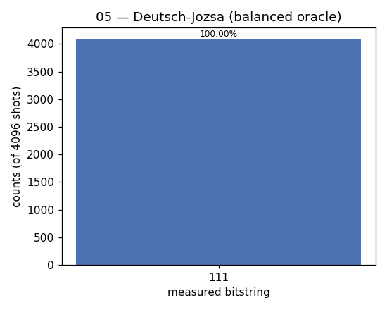

# 05 — Deutsch–Jozsa

**Difficulty:** ⭐⭐⭐
**Concept:** phase kick-back, interference, the first proven quantum speedup

## What is it for?
The first algorithm to *prove* a quantum computer can beat a classical one on a
(contrived) problem. It teaches the pattern every later algorithm reuses:
**superpose everything, query once, interfere, read the answer.**

## The problem
You get a black-box function `f` on `n` bits, promised to be either:
- **constant** — same output for every input, or
- **balanced** — 0 for exactly half the inputs, 1 for the other half.

Which is it?

| | queries needed |
|---|---|
| Classical (worst case) | `2^(n-1) + 1` |
| Deutsch–Jozsa | **1** |

## The trick
Prepare an ancilla in `|->`. When the oracle XORs `f(x)` into that ancilla, the
`f(x)` value comes back as a **phase** on the input (phase kick-back). Hadamards
before and after turn that phase pattern into interference:
- measure **all-zeros** → `f` is **constant**
- measure **anything else** → `f` is **balanced**

This demo uses a balanced oracle `f(x) = x0 ⊕ x1 ⊕ x2` (n = 3), so we expect a
non-zero string with certainty.

## Circuit
```
q0..q2: |0> ─[H]─┐        ┌─[H]─[measure]
                 │ oracle │
ancilla: |1>─[H]─┘  f(x)  └────
```

## Code
[`code/05_deutsch_jozsa.py`](../code/05_deutsch_jozsa.py)

## Run it
```bash
cd code && python3 05_deutsch_jozsa.py
```

## Result
Raw numbers: [`result/05_deutsch_jozsa.json`](../result/05_deutsch_jozsa.json)



| measured | count | probability |
|---|---|---|
| `111` | 4096 | 100.00% |

**Reading it:** the result is never `000`, so `f` is **balanced** — decided in a
single query with certainty.

## Takeaway
Phase kick-back + interference lets one query answer a question that classically
needs exponentially many. This template powers Bernstein–Vazirani, Simon, and
Shor.
