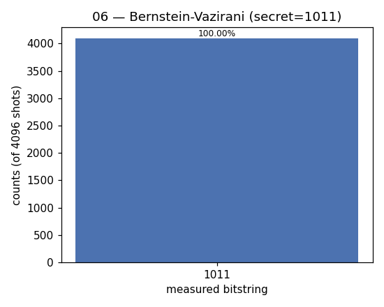

# 06 — Bernstein–Vazirani

**Difficulty:** ⭐⭐⭐
**Concept:** reading a hidden bitstring in one shot via phase kick-back

## What is it for?
A close cousin of Deutsch–Jozsa that recovers a whole **hidden string** in a
single query. It's the clearest demonstration that quantum parallelism can read
`n` bits of information for the price of one function call.

## The problem
A black box computes `f(x) = s · x (mod 2)` — the dot product of your input with
a secret string `s`. Find `s`.

| | queries needed |
|---|---|
| Classical | `n` (read one bit at a time) |
| Bernstein–Vazirani | **1** |

## The trick
Same phase kick-back as Deutsch–Jozsa. Superpose all inputs, apply the oracle
(a `CNOT` from input `i` to the ancilla wherever `s_i = 1`), then Hadamard
again. The interference writes `s` directly into the measurement.

This demo hides `s = 1011`.

## Circuit
```
inputs:  |0> ─[H]─┐    ┌─[H]─[measure]
                  │ CX │  (one CX per set bit of s)
ancilla: |1> ─[H]─┘    └────
```

## Code
[`code/06_bernstein_vazirani.py`](../code/06_bernstein_vazirani.py)

## Run it
```bash
cd code && python3 06_bernstein_vazirani.py
```

## Result
Raw numbers: [`result/06_bernstein_vazirani.json`](../result/06_bernstein_vazirani.json)



| measured | count | probability |
|---|---|---|
| `1011` | 4096 | 100.00% |

**Reading it:** the measured string *is* the secret `s = 1011`, recovered in one
query with certainty.

## Takeaway
One query, `n` bits of answer. Same machinery as Deutsch–Jozsa, but the
interference pattern spells out the entire hidden string instead of a yes/no.
