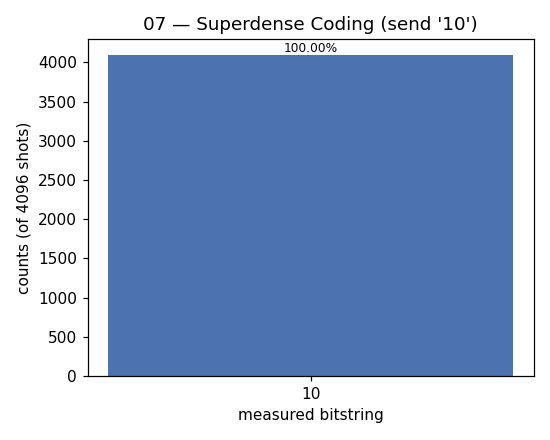

# 07 — Superdense Coding

**Difficulty:** ⭐⭐⭐
**Concept:** entanglement as bandwidth — 2 classical bits per 1 qubit

## What is it for?
The dual of teleportation (lesson 04). There you spent 2 classical bits to move
1 qubit; here you spend 1 qubit to move 2 classical bits. It's the clean proof
that a shared entangled pair effectively **doubles** the capacity of a quantum
channel.

## The setup
A Bell pair is shared in advance: Alice keeps `q0`, Bob keeps `q1`.

## How it works
Alice acts on **her qubit only** to encode 2 bits, then ships that one qubit to
Bob:

| bits | Alice applies |
|---|---|
| `00` | nothing |
| `01` | `Z` |
| `10` | `X` |
| `11` | `X` then `Z` |

Bob receives `q0`, undoes the entangling circuit (`CX` then `H`) and measures
both qubits — reading Alice's 2 bits exactly.

## Circuit
```
q0: |0>─[H]─■─[ Alice: X/Z ]─■─[H]─[measure]
           │                │
q1: |0>────X────────────────X──────[measure]
```

## Code
[`code/07_superdense_coding.py`](../code/07_superdense_coding.py)

## Run it
```bash
cd code && python3 07_superdense_coding.py
```

## Result
Raw numbers: [`result/07_superdense_coding.json`](../result/07_superdense_coding.json)



| measured | count | probability |
|---|---|---|
| `10` | 4096 | 100.00% |

**Reading it:** Alice sent `10`, Bob read `10` — with only one qubit crossing
the channel.

## Takeaway
Entanglement is a resource you can "spend." Teleportation and superdense coding
are the same trick run in opposite directions.
