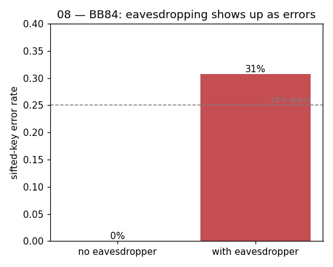

# 08 — BB84 Quantum Key Distribution

**Difficulty:** ⭐⭐⭐
**Concept:** measurement disturbance → provably secure key sharing

## What is it for?
BB84 (Bennett & Brassard, 1984) is the first quantum cryptography protocol and
is used in **real deployed hardware** today. Two parties build a shared secret
key, and physics guarantees any eavesdropper is **detected** — because
measuring a qubit in the wrong basis unavoidably disturbs it.

## How it works
For each bit:
1. **Alice** picks a random bit and a random basis: `Z` = {`0`,`1`} or
   `X` = {`+`,`-`}. She sends the encoded qubit.
2. **Bob** measures in his own random basis.
3. Publicly they compare **bases only** (never the bit values) and keep the
   positions where the bases matched — the **sifted key**. Those bits agree.

An eavesdropper **Eve** must guess the basis to measure in transit. Half the
time she guesses wrong, collapses the qubit, and forwards a corrupted one —
injecting ~25% errors into the sifted key. Alice and Bob sacrifice a few key
bits to estimate that error rate:
- ~0% → line is clean, keep the key.
- ~25% → eavesdropper present, throw the key away.

## This demo
Runs the protocol twice on the same random choices: once with no Eve, once with
Eve intercept-and-resend. It reports the sifted-key error rate of each.

## Code
[`code/08_bb84.py`](../code/08_bb84.py)

## Run it
```bash
cd code && python3 08_bb84.py
```

## Result
Raw numbers: [`result/08_bb84.json`](../result/08_bb84.json)



| scenario | sifted bits | error rate |
|---|---|---|
| no eavesdropper | 26 | **0%** |
| with eavesdropper | 26 | **~31%** |

Clean-line sifted key (Alice = Bob):
```
10000101011111111010100001
```

**Reading it:** with no Eve the keys match perfectly (0% errors). With Eve the
error rate jumps to ~25–31% (the exact number wobbles with the sample size) —
loudly detectable. That detectability *is* the security.

## Takeaway
You can't measure an unknown qubit without leaving a trace. BB84 turns that
physical fact into unconditionally secure key exchange.
