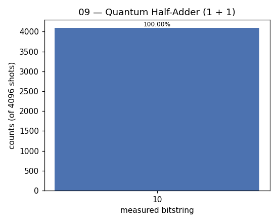

# 09 — Quantum Half-Adder

**Difficulty:** ⭐⭐⭐
**Concept:** reversible arithmetic + the Toffoli (CCX) gate

## What is it for?
Computers add numbers; so must quantum computers. This is the smallest adder —
a **half-adder** that adds two single bits `a + b` into a 2-bit result
(sum, carry). Its real payoff for this course: it introduces the **Toffoli /
CCX** gate (controlled-controlled-NOT), the reversible AND, which is the exact
building block Grover's oracle and diffuser use in lesson 12.

## The logic
```
sum   = a XOR b     ->  two CNOTs onto a fresh "sum" qubit
carry = a AND b     ->  one Toffoli onto a fresh "carry" qubit
```
Nothing is erased — the computation stays **reversible**, which every quantum
gate must be.

## This demo
Compute `1 + 1`. In binary that's `10`: sum = `0`, carry = `1`.

## Circuit (q0=a, q1=b, q2=sum, q3=carry)
```
q0(a):    ─■──────■────
q1(b):    ─│──■───■────
q2(sum):  ─X──X───│────[measure -> bit 0]
q3(carry):────────CCX──[measure -> bit 1]
```

## Code
[`code/09_quantum_adder.py`](../code/09_quantum_adder.py)

## Run it
```bash
cd code && python3 09_quantum_adder.py
```

## Result
Raw numbers: [`result/09_quantum_adder.json`](../result/09_quantum_adder.json)



| measured (carry,sum) | count | probability |
|---|---|---|
| `10` | 4096 | 100.00% |

**Reading it:** bitstring `10` = carry `1`, sum `0` = decimal `2`. So `1 + 1 = 2`,
computed reversibly on qubits.

## Takeaway
Classical logic ports to quantum via reversible gates. The Toffoli gate is the
workhorse — remember it, it reappears inside Grover.
