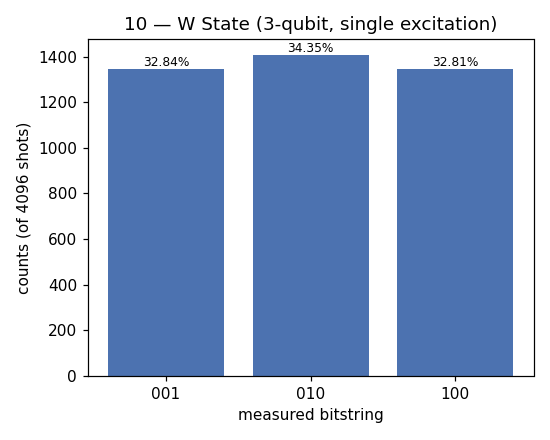

# 10 — W State

**Difficulty:** ⭐⭐⭐
**Concept:** a second class of entanglement + controlled rotations

## What is it for?
Not all entanglement is the same. GHZ (lesson 03) is "all or nothing": lose one
qubit and the whole thing collapses. The **W state** is the other famous 3-qubit
entangled class:
```
|W> = (|001> + |010> + |100>) / √3
```
exactly one qubit is `1`, but which one is undecided. Its special property:
trace out (lose) any one qubit and the remaining two **stay entangled**. That
robustness makes W states valuable for quantum memory and networking. GHZ and W
cannot be converted into each other by local operations — genuinely different
kinds of 3-way entanglement.

## How to build it
Start with the single excitation on `q0`, then use **controlled `Ry`
rotations** to share it down the chain with precisely the amplitudes that make
all three positions equally likely. This lesson is where controlled *rotation*
gates (not just `CNOT`) earn their keep.

## Circuit (sketch)
```
q0: [X]─●────────●──
        │        │
q1: ────Ry──●────X──
            │
q2: ────────Ry──X───
(controlled-Ry angles chosen for equal thirds)
```

## Code
[`code/10_w_state.py`](../code/10_w_state.py)

## Run it
```bash
cd code && python3 10_w_state.py
```

## Result
Raw numbers: [`result/10_w_state.json`](../result/10_w_state.json)



| measured | count | probability |
|---|---|---|
| `001` | 1345 | 32.84% |
| `010` | 1407 | 34.35% |
| `100` | 1344 | 32.81% |

**Reading it:** only the three single-`1` strings appear, each ~1/3. The one
excitation is shared equally across all three qubits.

## Takeaway
Entanglement has *types*. Controlled rotations let you dial in exact
amplitudes — the same tool that shapes states in more advanced algorithms.
