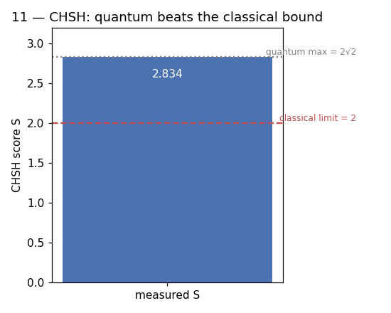

# 11 — CHSH Game / Bell Inequality

**Difficulty:** ⭐⭐⭐⭐
**Concept:** measuring quantum's advantage as a single number

## What is it for?
Is quantum weirdness real, or could hidden "pre-agreed" values explain
entanglement? The CHSH inequality settles it experimentally and turns it into a
score `S`:
- any **classical** / local-hidden-variable strategy obeys `|S| ≤ 2`,
- **quantum** entanglement reaches `|S| = 2√2 ≈ 2.828`.

Beating 2 is hard proof the world is not classical. Practically, the same test
**certifies** a device is genuinely quantum — the basis of device-independent
security. It's the natural step up from Grover's building blocks: real
correlations, real statistics, one clean number.

## How it works
1. Share a Bell pair.
2. Alice randomly measures along one of two axes `a0`,`a1`; Bob along `b0`,`b1`.
3. For each of the 4 combinations, estimate the correlation
   `E = P(agree) − P(disagree)`.
4. Combine: `S = E(a0,b0) + E(a0,b1) + E(a1,b0) − E(a1,b1)`.

Measuring "along an axis at angle φ" = rotate the qubit by `Ry(−φ)` first, then
measure in the usual `Z` basis. The angles below give the maximal violation.

## Code
[`code/11_chsh.py`](../code/11_chsh.py)

## Run it
```bash
cd code && python3 11_chsh.py
```

## Result
Raw numbers: [`result/11_chsh.json`](../result/11_chsh.json)



| correlation | value |
|---|---|
| `E(a0,b0)` | +0.710 |
| `E(a0,b1)` | +0.710 |
| `E(a1,b0)` | +0.710 |
| `E(a1,b1)` | −0.703 |
| **S** | **2.835** |

**Reading it:** `S ≈ 2.83`, comfortably above the classical ceiling of `2` and
essentially at the quantum maximum `2√2 ≈ 2.828`. (Slightly over 2√2 here is
just sampling noise.) No classical theory can produce these correlations.

## Takeaway
Entanglement isn't a metaphor — it is a measurable, quantifiable resource that
provably exceeds anything classical physics allows.
