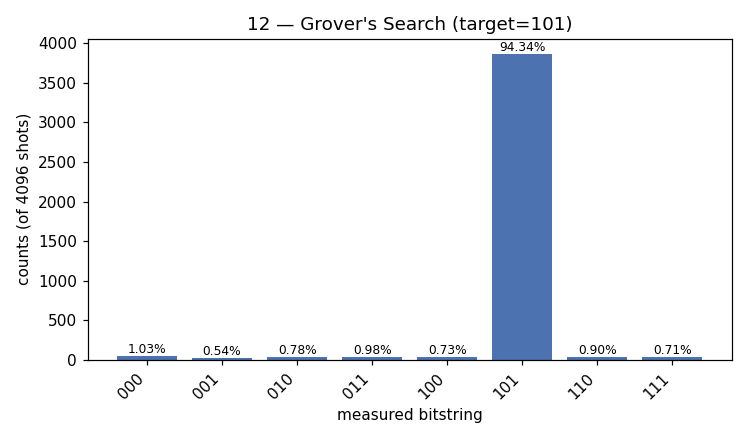

# 12 — Grover's Search

**Difficulty:** ⭐⭐⭐⭐
**Concept:** amplitude amplification, quadratic speedup

## What is it for?
Searching an **unstructured** space — a haystack with no index — for the one
item you can recognise. Grover finds it in about `√N` steps instead of the
classical `N`. That quadratic speedup applies to a huge range of brute-force
problems (SAT, cryptographic key search, database lookup).

## The problem
`N = 2^n` items, an oracle that recognises the target. Find it.

| | steps needed |
|---|---|
| Classical | ~`N/2` average, `N` worst case |
| Grover | ~`(π/4)·√N` |

## The trick — amplitude amplification
Start in an equal superposition of all items. Then repeat ~`(π/4)√N` times:
1. **Oracle** — flip the *sign* (phase) of the target item only.
2. **Diffuser** — reflect all amplitudes about their average.

Each round rotates probability toward the target like a ratchet. Too few rounds
and it's weak; too many and it *overshoots* back down.

This demo: `n = 3` (8 items), target `101`, optimal rounds =
`floor(π/4·√8) = 2`.

## Circuit (per round)
```
[H all] → ( [oracle: phase-flip 101] → [diffuser] ) × 2 → [measure]
```

## Code
[`code/12_grover.py`](../code/12_grover.py)

## Run it
```bash
cd code && python3 12_grover.py
```

## Result
Raw numbers: [`result/12_grover.json`](../result/12_grover.json)



| measured | count | probability |
|---|---|---|
| `101` | 3864 | **94.34%** |
| others (each) | ~20–42 | <1% each |

**Reading it:** after just 2 rounds the target `101` dominates at ~94%. The 6%
spread over the other states is the small residue Grover leaves for `N = 8`;
more qubits + optimal rounds push the target even higher.

## Takeaway
Grover doesn't "check" items — it *amplifies* the amplitude of the right answer
through interference. Quadratic, not exponential, but universally applicable to
brute-force search.
