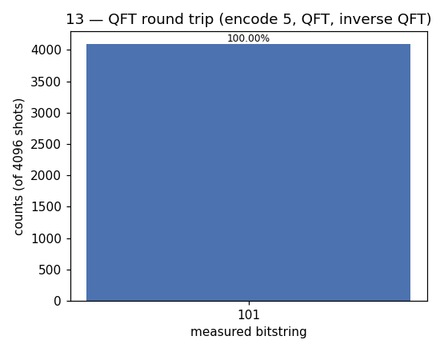

# 13 — Quantum Fourier Transform (QFT)

**Difficulty:** ⭐⭐⭐⭐
**Concept:** the quantum FFT — key subroutine of Shor & phase estimation

## What is it for?
The QFT is the quantum version of the discrete Fourier transform. It moves
amplitudes into the "frequency" domain and is the **core subroutine** inside
phase estimation and Shor's factoring algorithm. On `n` qubits it uses only
~`n²` gates, versus `n·2^n` operations for a classical FFT over the same
`2^n` amplitudes — an exponential saving in gate count.

## Why the demo is a "round trip"
Measuring right after a QFT just gives noise (the information is in phases). So
instead we demonstrate the two properties that make QFT useful:
- it is a **real unitary transform** built from `H` + controlled-phase gates, and
- it is **perfectly invertible**: `QFT` then `inverse-QFT` = identity.

We encode the number `5 = 101` into 3 qubits, apply QFT, then inverse-QFT, and
check the value survives.

## The building blocks
- `H` on each qubit.
- Controlled phase `cp(π/2^(k-j))` between qubits — the "twiddle factors."
- A final swap to reverse qubit order (QFT convention).

## Circuit
```
encode 5 → [QFT] → [inverse QFT] → [measure]
```

## Code
[`code/13_qft.py`](../code/13_qft.py)

## Run it
```bash
cd code && python3 13_qft.py
```

## Result
Raw numbers: [`result/13_qft.json`](../result/13_qft.json)



| measured | count | probability |
|---|---|---|
| `101` | 4096 | 100.00% |

**Reading it:** the input `101` (= 5) comes back untouched, confirming our QFT
and its inverse are correct and exactly cancel.

## Takeaway
The QFT itself doesn't "solve" a problem — it's the reusable lens that later
algorithms (phase estimation, Shor) look through to turn hidden **periods** and
**phases** into readable numbers.
