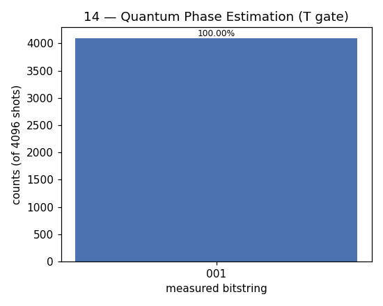

# 14 — Quantum Phase Estimation (QPE)

**Difficulty:** ⭐⭐⭐⭐⭐
**Concept:** extracting an eigenvalue phase — the engine of Shor & quantum chemistry

## What is it for?
Many gates act on their special **eigenstates** by only adding a phase:
```
U|ψ> = e^{2πi·phase} |ψ>
```
QPE estimates that unknown `phase` to `n` bits of precision. It is the beating
heart of **Shor's factoring** algorithm and of quantum **chemistry** energy
calculations (finding molecular ground-state energies).

## The setup in this demo
`U =` the `T` gate, whose eigenstate `|1>` satisfies `T|1> = e^{iπ/4}|1>`.
That phase is `π/4 = 2π·(1/8)`, so `phase = 1/8 = 0.001` in binary. With 3
counting qubits we can represent `1/8` exactly, so QPE should return `001`.

## How it works
1. **Counting register** (3 qubits) into superposition with `H`.
2. **Controlled-U^(2^j)**: counting qubit `j` applies `U` to the eigenstate
   `2^j` times, writing the phase into the counting qubits by kick-back.
3. **Inverse QFT** converts those phases into a plain binary number.
4. **Measure** the counting register → `phase × 2^n` as an integer.

## Circuit
```
counting: |0>─[H]─┐            ┌─[inverse QFT]─[measure]
                  │ ctrl-U^2^j │
eigen:    |1>─────┴────────────┴───
```

## Code
[`code/14_phase_estimation.py`](../code/14_phase_estimation.py)

## Run it
```bash
cd code && python3 14_phase_estimation.py
```

## Result
Raw numbers: [`result/14_phase_estimation.json`](../result/14_phase_estimation.json)



| measured | meaning | count | probability |
|---|---|---|---|
| `001` | phase = 1/8 = 0.125 | 4096 | 100.00% |

**Reading it:** the counting register reads `001` = 1, and `1/2³ = 1/8`, exactly
the phase of the `T` gate. (When a phase is *not* an exact fraction of `2^n`,
QPE returns the nearest few values as a peaked spread instead of a single spike.)

## Takeaway
QPE turns a physical phase into digits you can read. Wrap it around modular
exponentiation and you get Shor's algorithm; wrap it around a molecule's
Hamiltonian and you get its energy.
