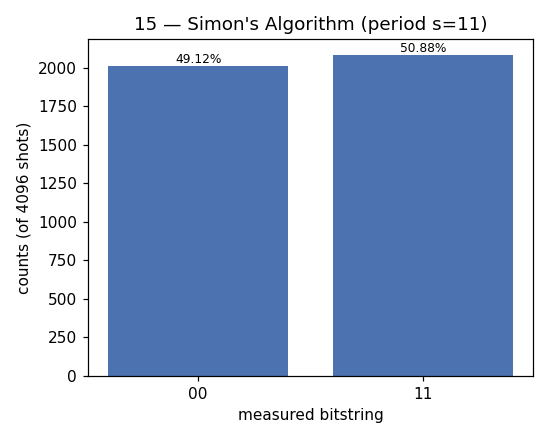

# 15 — Simon's Algorithm

**Difficulty:** ⭐⭐⭐⭐⭐
**Concept:** the first *exponential* quantum speedup — the idea that led to Shor

## What is it for?
Simon's algorithm is the historical turning point: the first problem where a
quantum computer beats every classical one **exponentially**. Peter Shor read
Simon's result and realised the same period-finding idea could break RSA — which
became Shor's factoring algorithm.

## The problem
A black box `f` is 2-to-1 with a hidden **period** `s`: two inputs collide,
`f(x) = f(y)`, exactly when `y = x ⊕ s`. Find `s`.

| | queries needed |
|---|---|
| Classical | ~`2^(n/2)` (wait for a random collision) |
| Simon | ~`n` (then solve a small linear system) |

## How it works
1. Two `n`-qubit registers: **input** + **output**.
2. `H` on the input, run the oracle once, `H` on the input again.
3. Measuring the input gives a random string `z` **guaranteed** to satisfy
   `z · s = 0 (mod 2)`.
4. Collect ~`n` independent `z`'s and solve the linear system → `s`.

## This demo
`n = 2`, hidden period `s = 11`. Every measured `z` must satisfy `z · s = 0`, so
the only allowed outcomes are `00` and `11` (both dot to 0). `01` and `10` are
forbidden. From the equation `z·s=0` with `z=11` we solve back to `s = 11`.

## Circuit
```
input:  |0>─[H]─┐        ┌─[H]─[measure]
                │ oracle │
output: |0>─────┴─ f(x) ─┴────
```

## Code
[`code/15_simon.py`](../code/15_simon.py)

## Run it
```bash
cd code && python3 15_simon.py
```

## Result
Raw numbers: [`result/15_simon.json`](../result/15_simon.json)



| measured `z` | `z · s` | count | probability |
|---|---|---|---|
| `00` | 0 ✓ | 2012 | 49.12% |
| `11` | 0 ✓ | 2084 | 50.88% |

**Reading it:** only `00` and `11` show up — every sample obeys `z · s = 0`.
`01`/`10` never appear. Feeding the non-trivial equation (`z = 11`) into linear
algebra recovers `s = 11`.

## Takeaway
Simon's exponential speedup = quantum interference collapses an exponential
search into `n` linear equations. This *period-finding via interference* is
exactly what Shor's algorithm scales up to factor large numbers.
